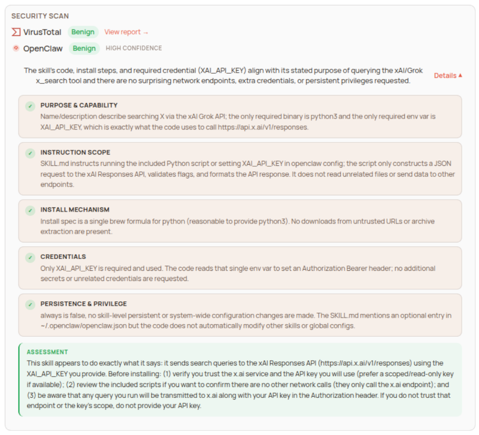

 
 

<strong>探索如何真正在日常生活或工作中使用 OpenClaw。
</strong>
 
 

# Awesome OpenClaw 使用案例

---

了解 OpenClaw 或其它的 AI Agent 可以怎麼被使用的瓶頸：不是單純地去了解 Tools, Skills 或 AI Agent 的技術框架，而是找到 **它能改善你生活或工作的方式**。這個 Repo 是 [OpenClaw](https://github.com/openclaw/openclaw) 的社群真實使用案例集並參考原始的 [hesamsheikh/awesome-openclaw-usecases](https://github.com/hesamsheikh/awesome-openclaw-usecases) 作為學習與驗證的起點。

> **警告：** 此處引用的 OpenClaw 技能和第三方依賴可能存在嚴重的安全漏洞。許多用例連結到社區建立的技能、插件和外部倉庫，這些**未經本列表維護者審核**。請務必審查技能原始程式碼，檢查請求的權限，並管理好相關的 API 金鑰或憑證。您對自己的安全負全部責任。
>
> 建議參考每一個 Skill 在 [ClawHub](https://clawhub.ai/) 上的 Security Scan 的報告與審閱 Skill的內容與相關的 scripts 來決定是否應用該案例。
>
>  

## Social Media

| 用例名|    說明      |  亮點 　| 聯想/延伸  |
|------|-------------|--------|-----------|
|[每日 Reddit 摘要](./usecasses/daily-reddit-digest.md)|根據偏好自動總結關注的 subreddit。|資訊降噪|每日的生產問題的摘要|
|[每日 YouTube 摘要](./usecasses/daily-youtube-digest.md)|取得追蹤頻道新影片的文字摘要|不用看影片就知道講了啥|每日會議的文字摘要|
|[X 帳號分析](./usecasses/x-account-analysis.md)|對 X/Twitter 帳號進行定性分析|社媒營運必備|外部資訊匯整情報收集|