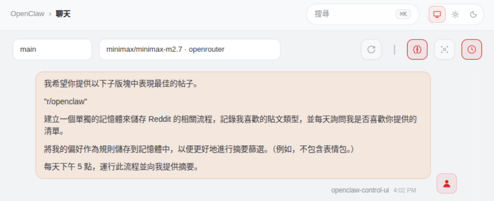
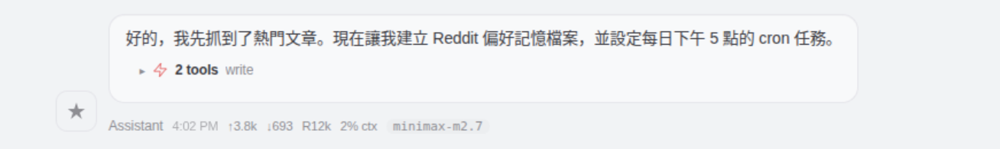
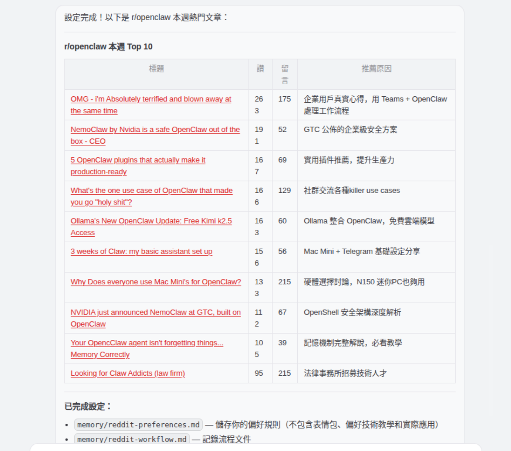
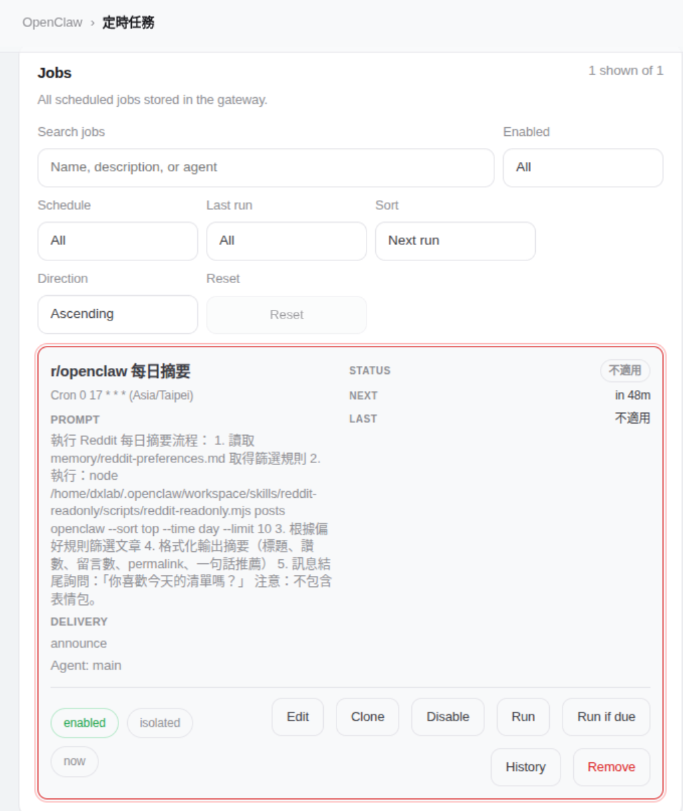

# Daily Reddit Digest

每天運行每日摘要，即可取得您最喜愛的討論區中最受歡迎的貼文。

用途：

- 瀏覽討論區（熱門/最新/置頂貼文）
- 按主題搜尋貼文 
- 擷取評論串以取得上下文資訊 
- 建立貼文清單以便稍後手動檢視/回复

> 此模式為唯讀模式，不會進行任何發佈、投票或留言。


## Skills you Need

[reddit-readonly](https://clawhub.ai/buksan1950/reddit-readonly) skill. 它不需要特別的身份驗證。

## How to Set it Up

### Method 1

**使用 ClawHub 命令列介面（建議）**

對於不介意使用命令列介面的使用者來說，用 ClawHub CLI 來安裝 Skill 這是一種常用且直接的方法。

```bash
# 安装任意技能，一条命令搞定
npx clawhub@latest install <skill-slug>
```

1. 開啟終端機或命令提示字元。
2. 如有需要，請在 ClawHub 註冊表中搜尋技能：

  ```bash
  npx clawhub@latest search "reddit-readonly"
  ```

  結果:

  ```bash
  reddit-readonly  Reddit (read only - no auth)  (2.654)
  reddit-read-only  Reddit (read only - no auth)  (1.151)
  reddit  Reddit  (1.125)
  search-reddit  Search Reddit  (1.009)
  reddapi  reddapi  (0.982)
  reddit-researcher  Reddit Researcher  (0.954)
  reddit-api  Reddit Search  (0.945)
  reddit-research  Reddit Research  (0.922)
  reddit-post  Reddit Post  (0.898)
  reddit-post-lab  reddit-post-lab  (0.883)
  ```

3. 使用其唯一的別名安裝所需的技能（例如，`reddit-readonly`）：

  ```bash
  npx clawhub@latest install "reddit-readonly"
  ```

### Method 2

透過與 OpenClaw 的聊天進行安裝。

發送類似這樣的訊息：

```bash
請用 Clawhub 為我安裝一個技能；技能名稱是 <skill-name>
```

##　How to Use it

安裝完此技能後，請在 OpenClaw 的 chat 中輸入：

**英文版**

```bash
I want you to give me the top performing posts from the following subreddits.

<paste the list here>

Create a separate memory for the reddit processes, about the type of posts I like to see and every day ask me if I liked the list you provided. 

Save my preference as rules in the memory to use for a better digest curation. (e.g. do not include memes.)

Every day at 5pm, run this process and give me the digest.
```

**中文版**

```bash
我希望你提供以下子版塊中表現最佳的帖子。

"r/openclaw"

建立一個單獨的記憶體來儲存 Reddit 的相關流程，記錄我喜歡的貼文類型，並每天詢問我是否喜歡你提供的清單。

將我的偏好作為規則儲存到記憶體中，以便更好地進行摘要篩選。（例如，不包含表情包。）

每天下午 5 點，運行此流程並向我提供摘要。
```










**LLM Usage 分析**

| Timestamp [1] | Provider / Model | App | Input Tokens | Output Tokens | Cost | Speed | Finish |
|---|---|---|---|---|---|---|---|
| Mar 22, 4:02 PM | MiniMax M2.7 | OpenClaw | 17,086 | 820 | $0.002120 | 44.1tps | stop |
| Mar 22, 4:02 PM | MiniMax M2.7 | OpenClaw | 16,479 | 259 | $0.001450 | 36.7tps | tool_calls |
| Mar 22, 4:02 PM | MiniMax M2.7 | OpenClaw | 15,791 | 625 | $0.002600 | 35.2tps | tool_calls |
| Mar 22, 4:02 PM | MiniMax M2.7 | OpenClaw | 12,036 | 134 | $0.001250 | 28.8tps | tool_calls |
| Mar 22, 4:02 PM | MiniMax M2.7 | OpenClaw | 10,873 | 200 | $0.000984 | 35.9tps | tool_calls |
| Mar 22, 4:01 PM | MiniMax M2.7 | OpenClaw | 11,217 | 186 | $0.000947 | 26.9tps | stop |
| Mar 22, 4:01 PM | MiniMax M2.7 | OpenClaw | 10,869 | 201 | $0.003440 | 31.1tps | tool_calls |

- Input Tokens: 94,351
- Output Tokens: 2,425
- Total Tokens: 96,776
- LLM Model: MiniMax M2.7
- Cost: USD	$0.012791 / NTD	$0.409824


## Reference

子版塊 (Subreddits) 是什麼意思？

簡單來說，Subreddit（通常縮寫為 "sub"）是指 Reddit 平台上的各個「子版塊」或「社群」

你可以把 Reddit 想像成一個巨大的森林，而每個 Subreddit 就像是森林裡的一棵樹，每一棵樹都代表一個特定的主題、興趣或地方社群。

### Subreddit 的核心特點：

- **專屬主題**：每個 Subreddit 都有一個核心主題。例如：
  - `r/technology`：討論科技新聞。
  - `r/funny`：分享有趣的圖片或影片。
  - `r/DIY`：分享手工藝或居家修繕心得。


- **命名格式**：Subreddit 的名稱前面一定會加上 `r/`，網址則是 ://reddit.com (例如 `https://www.reddit.com/r/openclaw/`）。
- **獨立規則與版主**：每個 Subreddit 都有自己的版規（Rules）和志願版主（Moderators，簡稱 mods）負責管理，以維持討論品質。
- **自訂首頁**：你可以訂閱感興趣的 Subreddits，Reddit 就會根據你的訂閱清單，在首頁呈現你感興趣的內容。
- **評分機制**：使用者可以對貼文投「贊成票」（Upvote）或「反對票」（Downvote），高票的內容會出現在該版塊的最上方。 