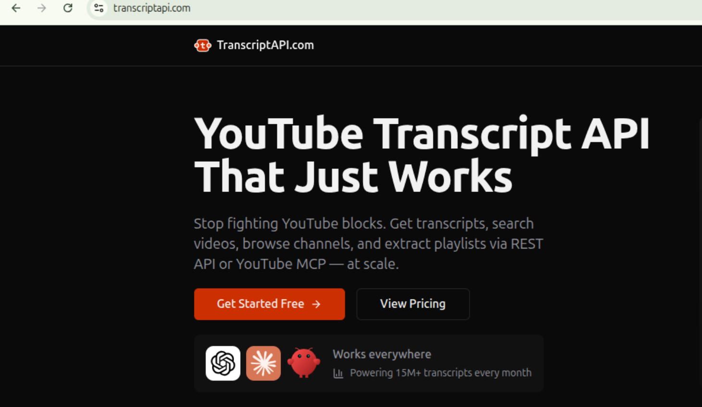
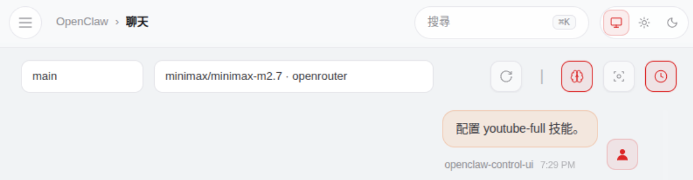
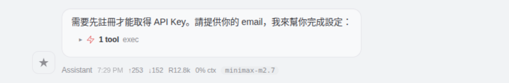
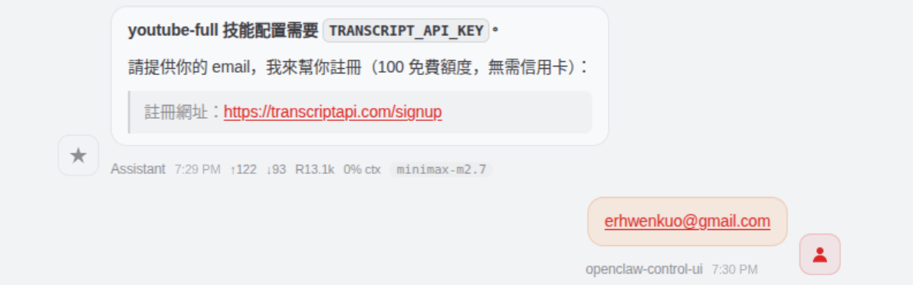
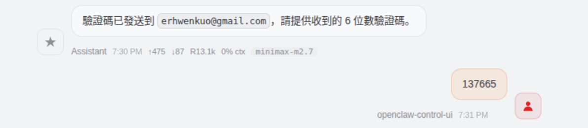
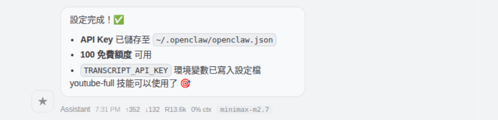
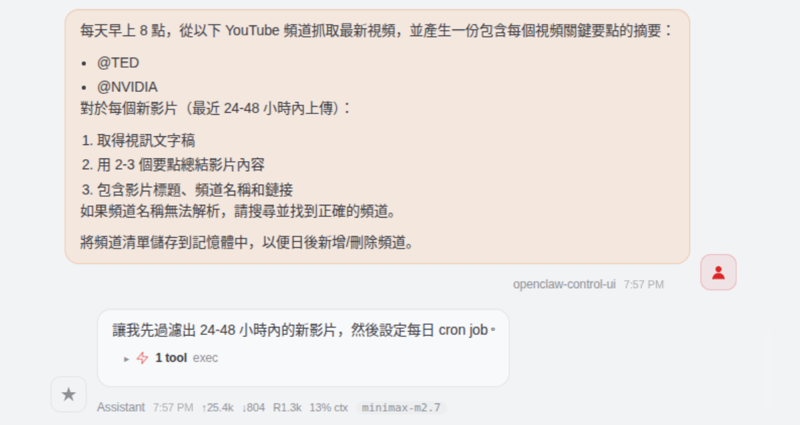
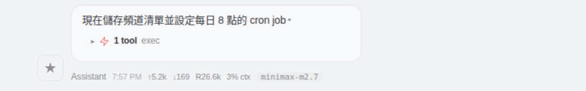
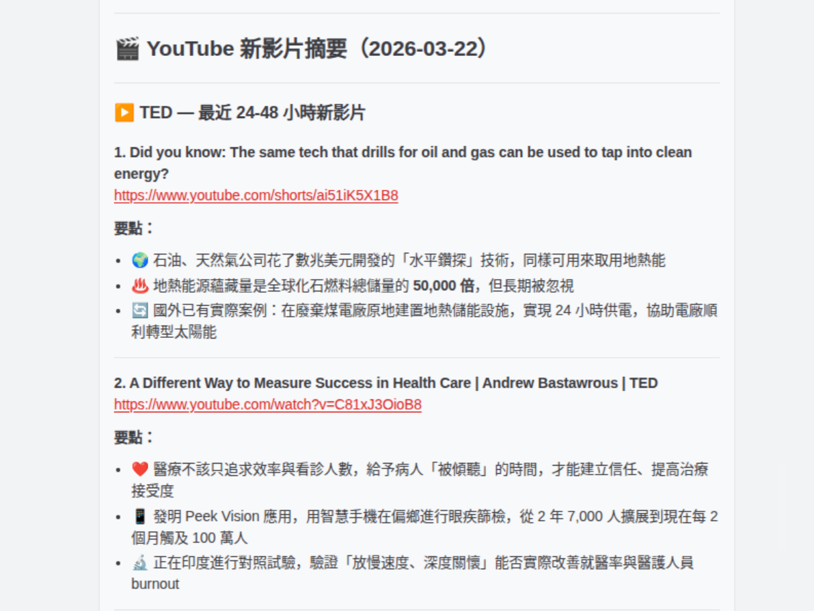
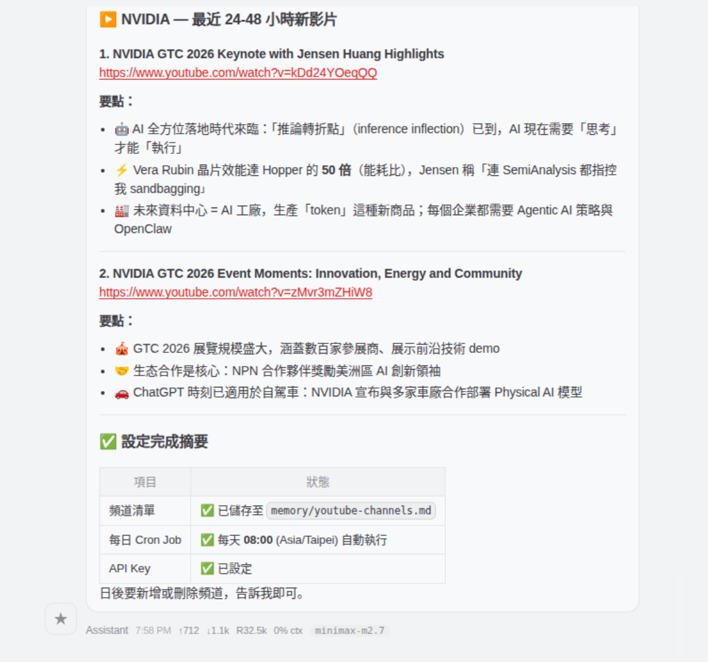

# Daily YouTube Digest

每天清晨，您都可以收到來自您最喜歡的 YouTube 頻道的最新影片個人化摘要——再也不會錯過您真正想關注的創作者的內容了。

## Pain Point

YouTube 的通知功能較不可靠。你訂閱了頻道，但它們的新影片從未出現在你的首頁推播中。它們不在通知裡，而是……消失了。這並非意味著你不想看——而是 YouTube 的演算法把它們埋沒了。

此外：每天早上看到精心挑選的內容，而不是漫無目的地瀏覽推薦訊息，豈不更有趣？

## What It Does

從您收藏的頻道清單中獲取最新視頻

總結或擷取每個視訊文字稿中的關鍵訊息

每日（或按需）向您發送視訊摘要

## Skills You Need

安裝 [youtube-full](https://clawhub.ai/therohitdas/youtube-full) 技能。

這是一個 Agent skill（透過 ClawHub/OpenClaw 註冊表發布），它提供了一個由 TranscriptAPI.com 提供支援的完整 YouTube 資料工具包。



### Skill structure

|File	|Purpose|
|-------|-------|
|`SKILL.md`|Skill definition — frontmatter metadata + full API reference|
|`_meta.json`|Registry metadata (owner ID, slug, version 1.4.1)|
|`scripts/tapi-auth.js`|Node.js CLI for passwordless account registration & API key setup|

## How to set it up

### Method 1

**使用 ClawHub 命令列介面（建議）**

對於不介意使用命令列介面的使用者來說，用 ClawHub CLI 來安裝 Skill 這是一種常用且直接的方法。

```bash
# 安装任意技能，一条命令搞定
npx clawhub@latest install <skill-slug>
```

1. 開啟終端機或命令提示字元。
2. 如有需要，請在 ClawHub 註冊表中搜尋技能：

    ```bash
    npx clawhub@latest search "youtube-full"
    ```

    結果:

    ```bash
    edison-youtube-full  Edison Youtube Full  (3.347)
    youtube-watcher  YouTube Watcher  (1.229)
    youtube-transcript  YouTube Transcript  (1.159)
    yt-dlp-downloader-skill  Yt Dlp Downloader  (1.047)
    tube-summary  tube-summary  (0.989)
    bilibili-youtube-watcher  Bilibili & YouTube Watcher  (0.980)
    youtube-shorts-automation  YouTube Shorts Automation  (0.960)
    youtube-publisher  YouTube Publisher  (0.944)
    youtube-watcherkx  YouTube Watcher  (0.923)
    video-dl  Video Dl  (0.916)
    ```

3. 使用其唯一的別名安裝所需的技能（例如，`youtube-full`）：

    ```bash
    npx clawhub@latest install "youtube-full"
    ```

### Method 2

透過與 OpenClaw 的聊天進行安裝。

發送類似這樣的訊息：

```bash
請用 Clawhub 為我安裝一個技能；技能名稱是 <skill-name>
```

### Configure Skill

安裝完此技能後，請在 OpenClaw 的 chat 中輸入：

**英文版**

```bash
Configure youtube-full skill.
```

**中文版**

```bash
配置 youtube-full 技能。
```











## How to Use it

### Option 1: Channel-based digest

請在 OpenClaw 的 chat 中輸入：

**英文版**

```bash
Every morning at 8 am, fetch the latest videos from these YouTube channels and give me a digest with key insights from each:

- @TED
- @Fireship
- @ThePrimeTimeagen
- @lexfridman

For each new video (uploaded in the last 24-48 hours):

1. Get the transcript
2. Summarize the main points in 2-3 bullets
3. Include the video title, channel name, and link

If a channel handle doesn't resolve, search for it and find the correct one.

Save my channel list to memory so I can add/remove channels later.
```

**中文版**

```bash
每天早上 8 點，從以下 YouTube 頻道抓取最新視頻，並產生一份包含每個視頻關鍵要點的摘要：

- @TED
- @NVIDIA

對於每個新影片（最近 24-48 小時內上傳）：

1. 取得視訊文字稿
2. 用 2-3 個要點總結影片內容
3. 包含影片標題、頻道名稱和鏈接

如果頻道名稱無法解析，請搜尋並找到正確的頻道。

將頻道清單儲存到記憶體中，以便日後新增/刪除頻道。
```

**Openclaw chat 截圖**:









### Option 2: Keyword-based digest

追蹤特定主題的新影片：

**英文版**

```bash
Every day, search YouTube for new videos about "OpenClaw" (or "Claude Code", "AI agents", etc).

Maintain a file called seen-videos.txt with video IDs you've already processed.
Only fetch transcripts for videos NOT in that file.
After processing, add the video ID to seen-videos.txt.

For each new video:
1. Get the transcript
2. Give me a 3-bullet summary
3. Note anything relevant to my work

Run this every morning at 9am.
```

**中文版**

```bash
每天在 YouTube 上搜尋關於　"OpenClaw"（或　"Claude Code",　"AI agents"　等）的新影片。

維護一個名為 seen-videos.txt 的文件，其中包含已處理的影片 ID。

僅取得不在 seen-videos.txt 檔案中的影片的文字稿。

處理完成後，將影片 ID 新增至 seen-videos.txt 檔案中。

對於每個新影片：

1. 取得文字稿
2. 提供三點式摘要
3. 記錄與我的工作相關的任何內容

每天早上 9 點運行此程序。
```

這樣你就不會浪費 TranscriptAPI.com 的 credits 來重新下載已經看過的影片了。


