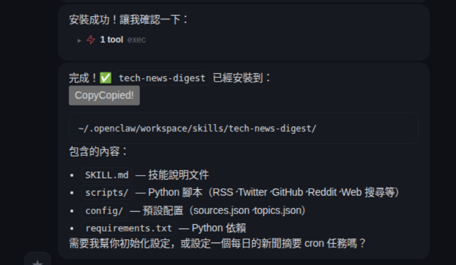
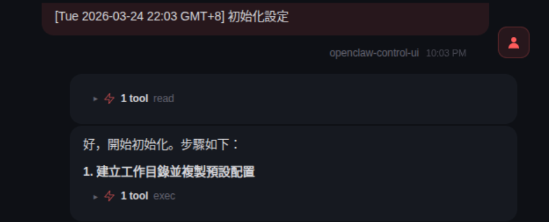
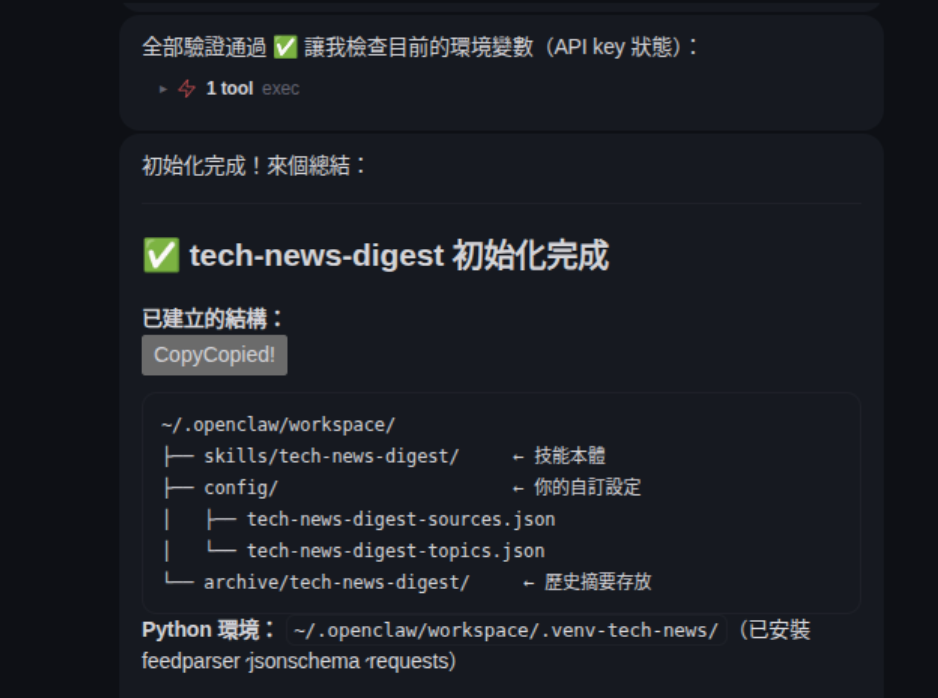
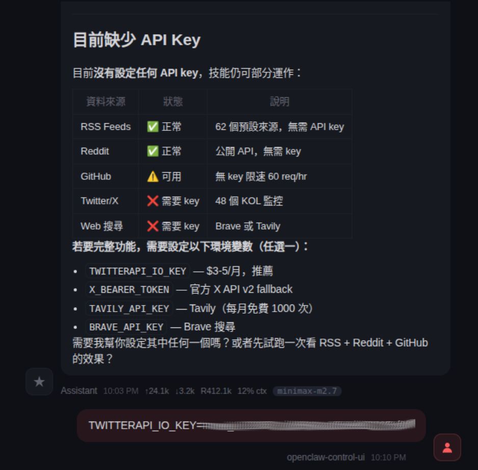
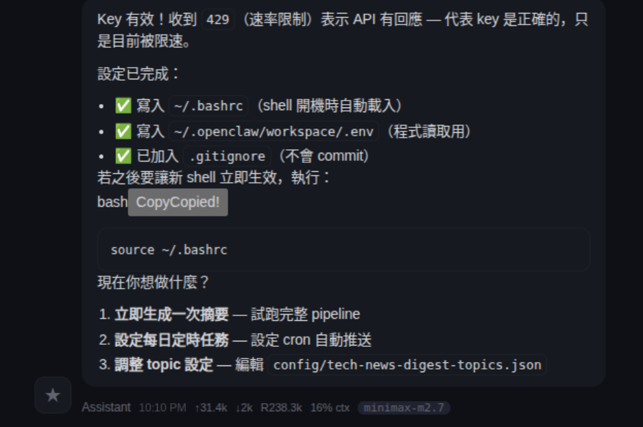
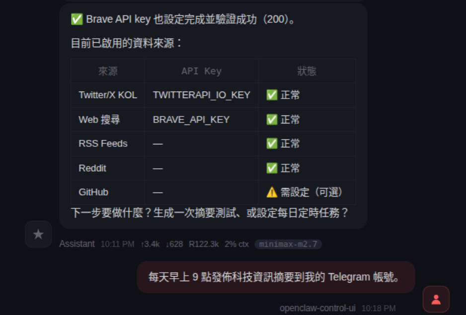
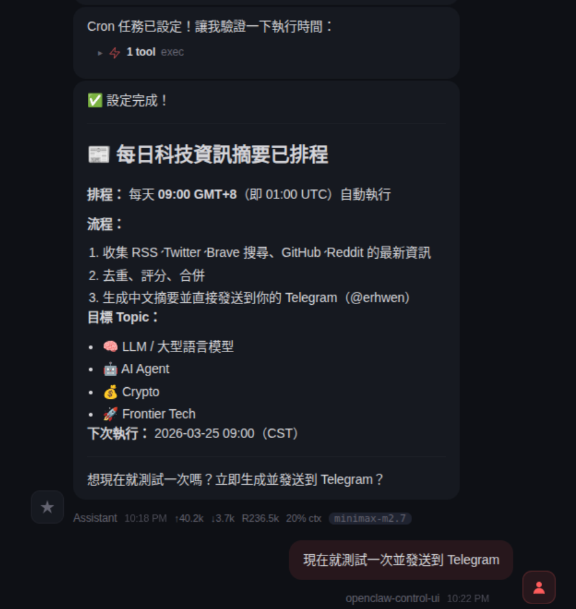
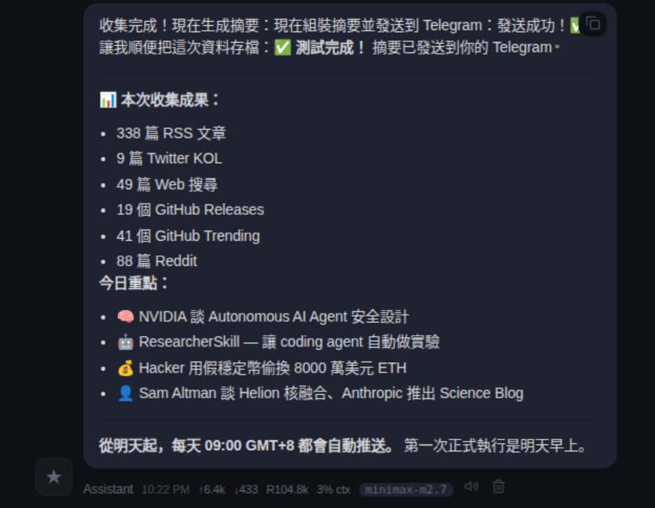

# Multi-Source Tech News Digest

自動整併、評分和發布來自 RSS,Twitter/X, GitHub 發布和網路搜尋等 109 多個來源的技術新聞——所有這些都透過自然語言進行管理。

## Pain Point

要隨時了解人工智慧、開源和尖端技術領域的最新動態，需要每天查看數十個 RSS 來源、Twitter 帳號、GitHub 程式碼庫和新聞網站。手動整理資訊既耗時又費力，而且大多數現有工具要么缺乏品質篩選功能，要么需要複雜的配置。

## What It Does

一個按計畫運作的四層資料管道：

1. **RSS 來源**（46 個來源）— OpenAI, Hacker News, MIT Tech Review 等。
2. **Twitter/X KOL**（44 個帳號）－ @karpathy, @sama, @VitalikButerin 等。
3. **GitHub 發布倉庫**（19 個程式碼庫）— vLLM, LangChain, Ollama, Dify 等。
4. **網路搜尋**（4 個主題搜尋）— 透過 Brave Search API。

所有文章都會合併，並根據標題相似度進行去除重覆，然後進行品質評分（優先來源 +3，多來源 +5，時效性 +2，互動性 +1）。最終摘要將發送到 Discord、電子郵件或 Telegram。

框架完全可自訂——只需 30 秒即可新增您自己的 RSS 來源、Twitter 帳號、GitHub 程式碼庫或搜尋查詢。

## Skills You Need

安裝 [tech-news-digest](https://clawhub.ai/dinstein/tech-news-digest) 技能。

這是一個 Agent skill（透過 ClawHub/OpenClaw 註冊表發布），它具有統一資料來源模型、品質評分流程和基於範本的輸出產生的自動化科技新聞摘要系統。


### Method 1

**使用 ClawHub 命令列介面（建議）**

對於不介意使用命令列介面的使用者來說，用 ClawHub CLI 來安裝 Skill 這是一種常用且直接的方法。

```bash
# 安装任意技能，一条命令搞定
npx clawhub@latest install <skill-slug>
```

1. 開啟終端機或命令提示字元。
2. 使用其唯一的別名安裝所需的技能（例如，`tech-news-digest`）：

    ```bash
    npx clawhub@latest install "tech-news-digest"
    ```


### Method 2

透過與 OpenClaw 的聊天進行安裝。

發送類似這樣的訊息：

```bash
請用 Clawhub 為我安裝一個技能；技能名稱是 "tech-news-digest"
```

### Configure Skill

安裝完此技能後，請在 OpenClaw 的 chat 中輸入：

**英文版**

```bash
Configure tech-news-digest skill.
```

**中文版**

```bash
配置 tech-news-digest 技能。
```

## How to Use it

**設定每日摘要:**

請在 OpenClaw 的 chat 中輸入：

**英文版**


```bash
Set up a daily tech digest at 9am to Telegram.
```

**中文版**

```bash
每天早上 9 點發布科技資訊摘要到我的 Telegram 帳號。
```

## Openclaw Chat 截圖

















