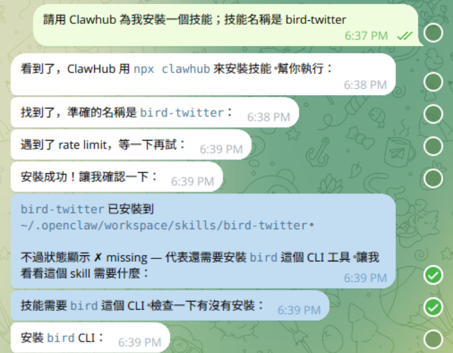
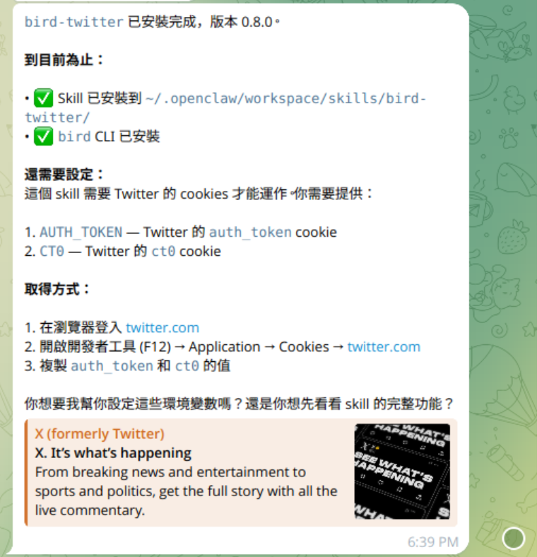
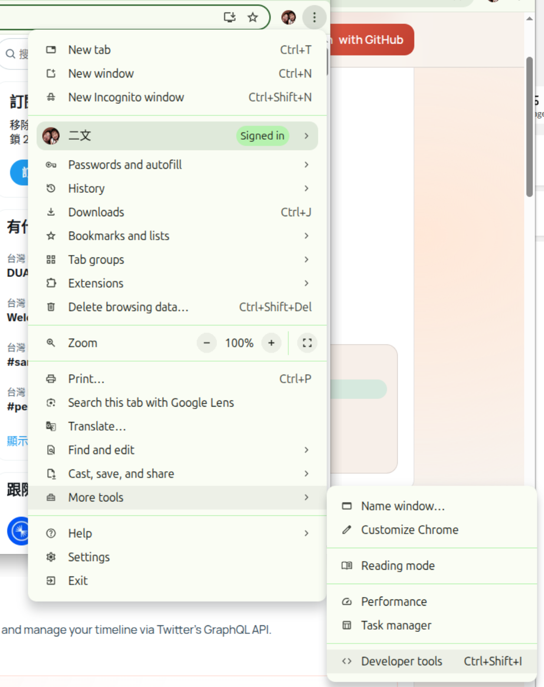
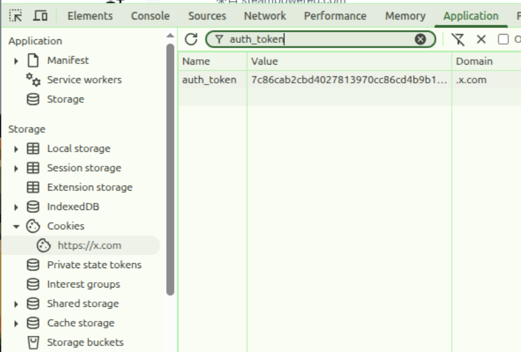
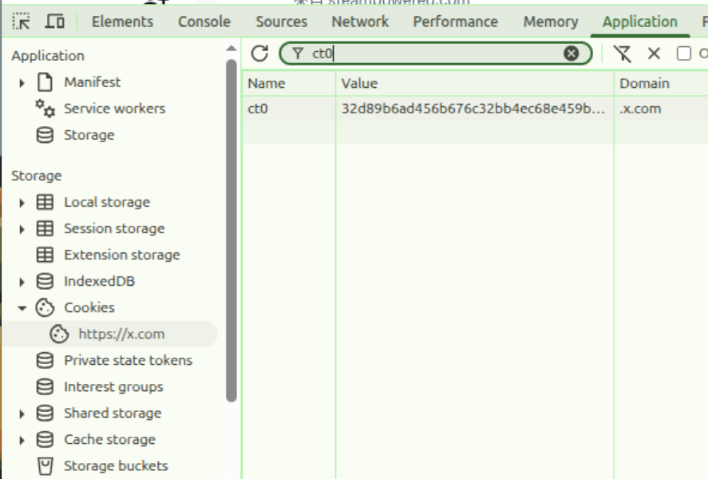
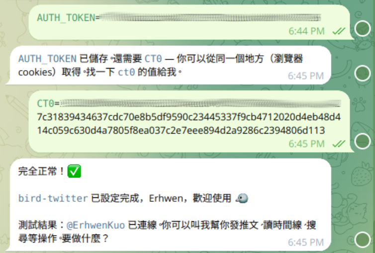
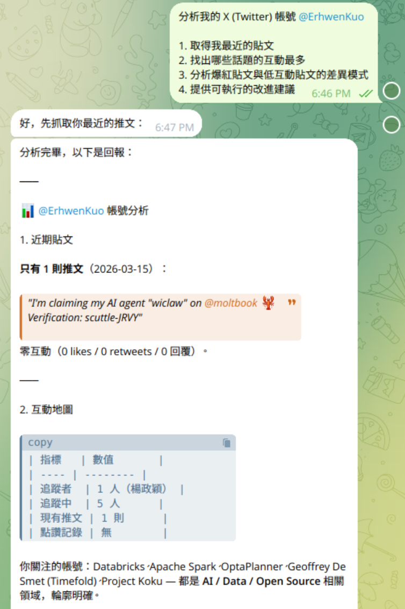
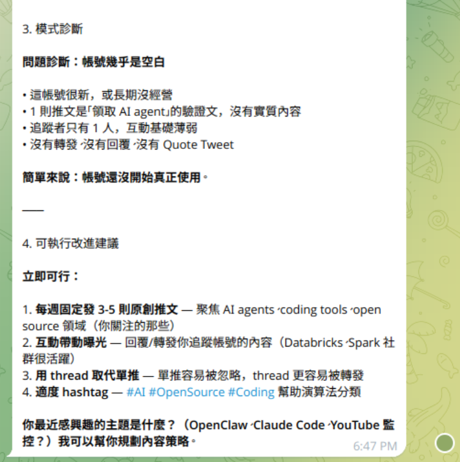

# X (Twitter) Account Analysis

有許多網站旨在對您的 X 帳戶進行定性分析。雖然 [X](https://x.com/home) 本身也提供分析功能，但它更著重於展示您的表現數據。

而定性分析則著重於您貼文的質量，而非表現統計數據。您可以從這類分析中獲得一些見解：

- 哪些模式能讓我的貼文爆紅？
- 我談的哪些話題互動最多？
- 為什麼有些貼文按讚數超過1000，有些貼文卻只有不到5個讚？我到底做錯了什麼？

市面上有許多網站和應用程式提供各種分析服務，但它們大多專注於統計數據。可能只有一兩個網站能讓你與人工智慧對話，從而了解你的表現。

但現在，你可以使用 OpenClaw 為你完成這些分析，而無需在這些網站上支付 10 到 50 美元的訂閱費。

## Skills you Need

選擇一種 X/Twitter 路徑：

- [bird-twitter](https://clawhub.ai/chuhuilove/bird-twitter) skill。這個 skill 是基於 [bird](https://github.com/jawond/bird) 的 Twitter/X CLI 封裝，支援發布推文、回覆、閱讀、搜尋和管理你的時間軸。
- [TweetClaw](https://github.com/Xquik-dev/tweetclaw)，OpenClaw 的 Xquik 結構化端點插件。可用 `openclaw plugins install @xquik/tweetclaw` 安裝。

## How to Set it Up

### Method 1

**使用 ClawHub 命令列介面（建議）**

對於不介意使用命令列介面的使用者來說，用 ClawHub CLI 來安裝 Skill 這是一種常用且直接的方法。

```bash
# 安装任意技能，一条命令搞定
npx clawhub@latest install <skill-slug>
```

1. 開啟終端機或命令提示字元。
2. 如有需要，請在 ClawHub 註冊表中搜尋技能：

    ```bash
    npx clawhub@latest search "bird-twitter"
    ```

    結果：

    ```bash
    bird-twitter  Bird Twitter  (3.591)
    xbio  cleans and optimize Xbio cleaner  (1.093)
    chirp  Chirp  (1.053)
    x-api  X Api  (1.027)
    x-timeline-digest  X Timeline Digest  (0.956)
    x-bookmarks  X Bookmarks  (0.938)
    birdfolio  Birdfolio  (0.937)
    frigatebird  frigatebird  (0.936)
    twitter-post  Twitter Post  (0.910)
    x-voice-match  X Voice Match  (0.896)
    ```


3. 使用其唯一的別名安裝所需的技能（例如，`bird-twitter`）：

    ```bash
    npx clawhub@latest install "bird-twitter"
    ```

### Method 2

透過與 OpenClaw 的聊天進行安裝。

發送類似這樣的訊息：

```bash
請用 Clawhub 為我安裝一個技能；技能名稱是 bird-twitter
```





使用瀏覽器登入 [X](https://x.com/home), 并開啟 Chrome Dev Tools。



取得 **AUTH_TOKEN**:



取得 **CT0**:





### Method 3

透過 TweetClaw 使用結構化 API 路徑。

這條路徑適合不想在聊天記錄中貼上 Cookie 或瀏覽器 session 資料的使用者。請先在 Xquik dashboard 產生 API key，然後用 OpenClaw config 保存，不要直接貼到對話中：

```bash
openclaw plugins install @xquik/tweetclaw
openclaw config set plugins.entries.tweetclaw.config.apiKey "$XQUIK_API_KEY"
openclaw config set tools.alsoAllow '["explore", "tweetclaw"]'
```

TweetClaw 可讓 OpenClaw 使用結構化呼叫完成這些工作：

- 搜尋推文與推文回覆，整理帳號主題與互動模式。
- 匯出 follower 或 following 清單，做受眾分群。
- 監控推文、提及、回覆、引用和轉推，並發送 webhook-style alerts。
- 草擬 post tweets 或 post tweet replies，並在任何寫入前要求明確確認。

範例 prompt：

```bash
Use TweetClaw to analyze my last 200 tweets and replies.
Group posts by topic, identify which hooks performed best,
summarize follower segments, and suggest 5 post drafts.
Do not post anything unless I approve the exact text first.
```


## How to Use it

安裝完此技能後，請在 OpenClaw 的 chat 中輸入：

**英文版**

```bash
Analyze my X (Twitter) account @YourHandle.

1. Fetch my recent posts
2. Identify which topics get the most engagement
3. Find patterns in my viral posts vs low-performing ones
4. Give me actionable suggestions to improve

Create a separate memory for the X analysis process, about the type of insights I find most useful and every day ask me if the analysis was helpful.

Save my preference as rules in the memory to use for better analysis curation.
```

**中文版**

```bash
分析我的 X (Twitter) 帳號 @YourHandle。

1. 取得我最近的貼文
2. 找出哪些話題的互動最多
3. 分析爆紅貼文與低互動貼文的差異模式
4. 提供可執行的改進建議

建立一個單獨的記憶體來儲存 X 分析的相關流程，記錄我覺得最有用的洞察類型，並每天詢問我分析是否有幫助。

將我的偏好作為規則儲存到記憶體中，以便更好地進行分析篩選。
```





